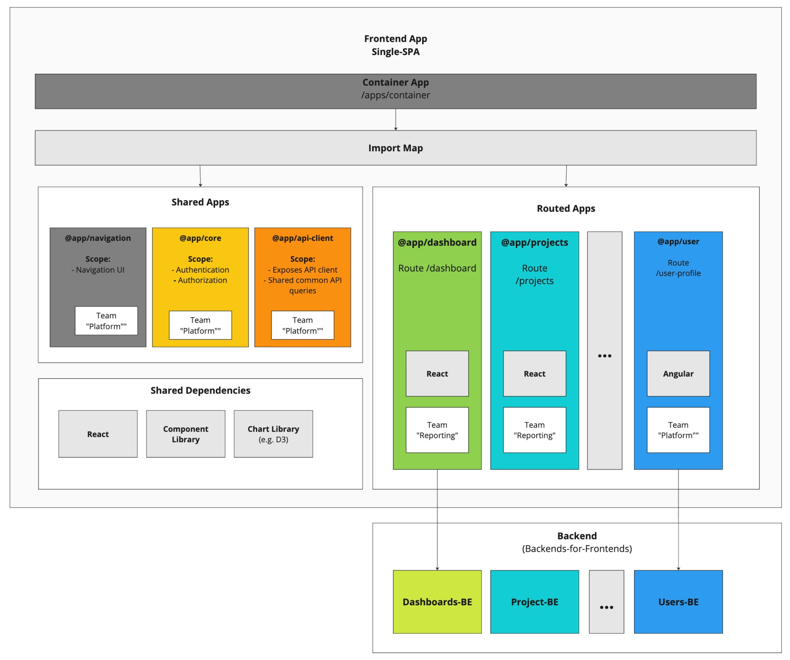

# Welcome!
In this document I provide all the expected inputs for the example Micro-Frontend app home assignment.

The document consists of the following sections:
- **[How to run?](#how-to-run)** - Commands on how to "consume" the example app & navigate it
- **[Preface](#preface)** - Additional context necessary to interpret my decisions / tradeoffs made within the context of this task
- **[Documentation](#documentation)** - All the expected sections of the documentation shared in the requirements (Architecture, Developer Guide, Onboarding etc.)
- **[Epilogue](#epilogue)** - Some finishing comments

**Video onboarding:** For additional context and introduction to the results of the documentation and code, please refer to [Video Commentary](https://example.com).
Note: Video documentation can be **very** effective and I use and recommend using it heavily across every organisation I work with.

---
# How to run?
### Prerequisites:
1. Install `nvm`
2. Install required `nvm` version: `nvm install`
3. Switch to required npm version: `nvm use`

### Testing & Linting:
1. Install dependencies `yarn install`
2. Run unit tests: `yarn test`
3. Run lint: `yarn lint`

### Run app
1. Install dependencies `yarn install`
2. Start the app: `yarn start`
3. Open the app: [http://localhost:9000/]()

---
# Preface

### Assumptions
Based on the description of the task, I have made the decision to use Single-SPA as the top-level router for the app. **The reasons are:**
- I have existing experience with this top-level router allowing me to minimise bootstrap work and focus work on evaluation criteria
- The technology connecting the Micro-FE is likely to be *relatively* easy to replace with another technology given we establish the right architectural constraints and avoid vendor lock-in

Alternatives I could have considered:
- Custom self-built solution - would likely entail some tradeoffs and wouldn't result in a "real" Micro-FE app given the acute time constraints
- Webpack Module Federation
- Multiple other frameworks (FrintJS, Luigi, Bit)

**Remark**: I have experience working within organisations of different sizes and maturity, therefore I always adapt my solutions to the needs of the team and organisation. In this documentation I list the factors I take into account, make my own best assumptions and then provide a recommendation based on my existing knowledge of Plan A engineering organisation. I will be happy to run such assumptions and ideas with interviewers during next stages :) 

### Documentation above implementation
As a rule, while working on this task I put more emphasis on documentation above implementation.
Tasks such as: linting, CI automation are relatively simple and linear - I can deliver results given enough time, as I would expect any experienced developer to do the same. I assumed you will learn more about my skillset by learning my mindset rather than reading bits of configuration that can be frankly - AI-generated.
I am happy to discuss my ideas and my code during an interview :)

-----
# Documentation

## Architecture overview:
The App is a Micro-Frontend app, and has the following key features:
- Built using [Single-SPA](https://single-spa.js.org/) Micro-Frontend top-level router
- Mono-repo using [Lerna](https://lerna.js.org/)
- Yarn as a package manager
- Apps built using React
- The app uses TypeScript

**How does the app work?**
The app consists of 3 Micro-Frontend apps.
The Micro-Frontend apps are located in `apps/*` directory.
There are 3 apps:
- `apps/container` - the root config app, which defines the overall HTML structure of the app and an import map pointing to where to load other Micro-Frontends from
- `apps/dashboard` - app rendered on the `/dashboard` path that acts as a dashboard for various charts
- `apps/navigation` - app responsible for rendering navigation components, login functionality (currently mocked) and authentication (handling JWT token passed in the URL on login)

**How does the app work?**
1. **Lerna Monorepo** - lerna defines and orchestrates all separate packages that are run together as the Micro-Frontend bundle. Switching to a Monorepo can be considered depending on the team workflow & processes.
    - The `package.json` in the `root` directory defines commands that are batch ran for all Micro-Frontends = starting the apps, running tests etc.
2. **Container app** - `apps/container`
    - This app renders `index.ejs` file
    The file defines shared dependencies and Micro-Frontend apps through import-maps (see `<script type="systemjs-importmap">` script tags)
    - The app also consists of a top-level Micro-Frontend router in the `microfrontend-layout.html` file. This file defines the structure of the app and defines routes.
3. **Navigation app** - `apps/navigation`
    - The app is rendered on all authenticated paths
    - The app is responsible for:
        - Rendering navigation components (desktop header)
        - Handling authentication (auth flow - reading JWT token in URL and/or local storage -> to be moved to a separate `utility app`)
        - Displaying user profile information and login/logout buttons
4. **Dashboard app** - `apps/dashboard`
    - Single page app rendered on `/dashboard` path
    - The app does not have any dependencies on other Micro-Frontends, as is expected for futher routed apps

**Diagram:**

**Remarks:**
- This is a diagram of a more complex architecture - as the existing setup with 2-3 apps would be overly simplistic.
- Given more time I'd use a code-based tool (e.g. [Mermaid](https://www.mermaidchart.com/))
- The presented diagram is addressed towards an audience of a mid-level technical skill level (goal of the diagram = list main components of the architecture - apps, dependencies and their relations to team responsibilities)

**Remarks:** Given 2 more hours spent on this assignment, I would also:
- Separate authentication functionality into a `utility` (non-visual) app - let's say `@simon/core` app
The app would expose:
    - A configured `fetch` / `axios` client with an `auth` token interceptor that adds appropriate headers
    - Functionality to verify whether the user is authenticated - to be used by other apps
    - Other generic aspects: deep linking, maybe installing integrations (e.g. GTM)
- Introduce route guards - don't allow rendering `/dashboard` when the user is not authenticated

**Comments on CI/CD:** CI/CD pipelines for Micro-Frontend apps are naturally more complex compared to regular single page applications. Single-SPA framework offers some guidelines on how to structure those pipelines. For the purpose of this task I omitted the implementation of this aspect of the application, however it's worth mentioning some challenges:
- Built apps are static resources, deployed to a CDN and linked to the container app through an import map
- Whenver new apps are deployed, the import map also needs to be updated
- Single-SPA offers a tool named import map deployer to ensure parallel deployability without risks of conflicts / overriding

## Testing strategy:
My testing strategy depends on multiple factors:
- Maturity of the product & expected changes
- Maturity of the codebase
- Development team skill level & preferences
- Size of the team

**My initial proposal:**
As a baseline, my personal preference towards a testing strategy is:
- Unit tests:
    - *Do:* Primarily test business logic in state and utility code
    - *Do:* Cover critical components with unit tests (shared components, core components)
    - *Avoid:* Full test coverage of all components by default - provided that the codebase has the right separation of business logic and presentation logic, visual tests in Storybook might be sufficient to avoid visual regressions that don't introduce the risk for the user to not be able to use the app.
- Integration tests:
    - *Do:* Cover critical user-flows with integration tests - including both state *and* components. Do this *especially* for user flows that are not used daily and frequently - e.g. onboarding flows, where if broken might be discovered in production.
- e2e tests:
    - *Consider:* Using e2e smoke tests to ensure the application is *wired* correctly
    - *Avoid:* e2e tests of full user flows deep within the app. They tend to be costly, flaky and produce false positives and negatives when not robust enough.

I adapt my strategy towards the needs of the team & product. While I found a leaner and more focused strategy to work well in a scale up, I also do have experience working with Extreme Programming engineering teams following strict TDD practices and am comfortable with applying such strategies.

## Developer Guide:
I consider a good "Getting started" guide to primarily focus on:
- Encouraging developers to experiment and work the code
- Pointing to the neccessary resources and theory
- Provide a concise list of best practices learned and applied by the team

The structure of such a guide would be:
- **Entry-point** - consists of a "Warm Welcome!" message, short summary & links to all further resources (internal & external).
- **Our Values** - defines the mindset team members should demonstrate when interacting with the architecture, team and stakeholders
- **Architecture overview** - diagram, main principles - written in a way that doesn't get outdated very often = big picture, does not need to contain info about every single module.
- **Best practices**
I personally like Angular docs style of such guides, with advice grouped into *Do*, *Consider*, *Avoid*.
Such sections *should* include:
    - **Security** - list of measures documenting security practices
    - **Accessibiliy** - similar to above :)
    - **Tracking** - how do we track user behaviour & ensure it's analysable - extremely important aspect of the app, as it allows us to know how our users interact with the app. In such documents I also often list tracking events sent to tag manager solution (e.g. Google Tag Manager)
    - **Component library** - info on how to contribute / best practices etc.
    - **Dependency management** - defines how to add a new dependency, licensing strategy etc.
- **"How Tos" repository**
    - List of documents with a simple step-by-step guide. Intended as an easy-to-consume simple instructions.
    - Examples:
        - "How to create a new Micro-FE?"
        - "How to add a new dependency to be shared between Micro-FEs?"
        - "How to add a new shared component to the Component Library?"
        - etc.

**⚠️ Important: ⚠️** The most important part of documentation is the right culture around documentation. There are no *"consumers"* of documentation, we are **all** *"producers"* :muscle:
Based on this, I always communicate the following principles to colleagues:
- If you see documentation needs improvements - improve them **now!** :)
- Write ADRs for your proposals - explaining the context, evaluated tradeoffs, decision helps you organise your thoughts and obtain feedback
- When onboarding to the team, one of your most important first missions is to **improve** the documentation for the next onboardee

## Mentoring and Onboarding:
In my leadership experience I generally prefer a hands-off approach. Hiring developers with a self-starter mentality is key! In a startup phase we should always prioritise such hires.

The most important factors I focus on to ensure a good onboarding experience are:
- **Documentation** - concise and up-to-date - especially the "How to" guides for very common challenges
- **Good selection of onboarding tasks** - usually 2-3 weeks before a new developer starts, I like to curate a backlog of starter tickets that are most likely to allow the new hire to deliver value while maximising their learning opportunities
- **Onboarding checklist** - list of resources (documents, guides, videos, courses) that a new hire should consume and skills they should obtain within their first week, 30 days and 90 days
- **Engineering Levels** - a mature engineering organisation **needs** to have a well defined career path, with expectations defined for all seniority levels. Key skills related to FE architecture should be included there as well.
- **Pair programming** - it's an excellent practice that can be applied in many areas and good onboarding is definitely one of them. I recommend a quota of at least 50% of time spent pair programming especially during onboarding.
- **Build a relationship** - super important, we have various tools that ensure a new hire feels welcome and safe to ask for help. Tools I apply to ensure this:
    - Showing vulnerability by myself as a leader
    - Going out for a beer, team event, board game night after work - online or offline
    - Regular pairing sessions
    - Weekly 1:1s

**⚠️ Important:** People learn and perform best when they feel safe 🤗. I strongly emphasize for developers in my teams to not be afraid of failure and to ask questions, and to take measured risks. The same mindset should be consistently projected by the entire team :muscle:

## Stakeholder Communication:
Strongly depends on the context: *Are we presenting a concept? Are we asking to allocate resources for such a project? Are we asking for additional time in the roadmap to be allocated for the project?*

**Assumption:** that as a tech team we wish to roll-out a new architecture and would like to build momentum and excitement across the organisation.

Communication plan:

1. **Identify stakeholders**
    - Core Team - FE team, Tech Leads, CTO / Head of Engineering
    - Involved - Product & Design (leaders and/or individual contributors in such positions), any other developers who wish to be involved
    - Informed - Marketing (tracking), Business (exact stakeholder depends on context)
2. **Initial "Buy-in"**
    In this phase I would focus on gathering functional and non-functional requirements from key involved stakeholders. It is important to learn their needs and concerns as fast as possible.
3. **Kick-off**
Once the concept is crystalized, I recommend grouping stakeholders to build excitement. A 45-minute session should be sufficient. Presentation plan:
    - **Context** - explain where we are now:
        - Summarise - FE architecture & product state
        - Where are we headed - reference important aspects of the product vision & company mission; will be useful for stakeholders to understand how our Micro-FE strategy will drive us in this direction
    - **Story of how things are not *good-enough* now:**
    Give an example of a story / epic that the org struggled recently, and paint a clear picture of the challenges we faced.
    *For example:* We wanted to implement feature ABC, but we ended up introducing bugs in the process, had to spend X number of hours coordinating etc.
    - **Innovative solution**
    Explain the concept of Micro-FEs -> needs to be very simple, 1-2 slides and little jargon - just demonstrate the concept
    - **Benefits** - likely the most important point in the context of this assignment. Listed **[HERE](#key-benefits-of-the-architecture)**
    - **Roadmap** - concise list of milestones, forming the right expectations
4. **Regular check-ins**
Ensure regular updates for the wider organisation. Rough schedule:
    - Bi-weekly engineering-wide show & tells
    - Updates on roll-out progress with product & design - I'd use existing ceremonies such as `PM <> Tech sync-ups` and a `Design <> Frontend Jour Fixe`
    - Company level updates on initative whenever major milestones are reached - non-technical & used for celebrating success

### Key benefits of the architecture:
- **:muscle: Team independence & scalability** - teams can work without unneccessary obstacles & coordination red-tape = we are ready to scale to a big and mature organisation
- **:star: We are on the bleeding edge of tech** - connect this initiative to an innate startup desire to *push the needle*, it can resonate (of course it's culture dependent). Also communicate how we can avoid vendor lock in and evolve the codebase alongside of trends.
- **:car: Speed of delivery** - argue how this can improve our velicity
- **:handshake: Collaboration** - Micro-Frontends can incentivise a more streamlined collaboration between **FE & Designers** (& get Designers to argue for this architecture) and also **FE & BE** (they promote a Backend-for-Frontend collaboration model!)

**Remarks:**
- In my presentations I focus on simplicity and really scale down the technical jargon as much as possible. I apply storytelling - I would most likely tell a story on how a certain type of project would work out with Micro-FEs vs. without.
- Presentations need to be entertaining and engaging - we are hard-wired to listen to stories = if hired, expect tons of memes in my communication ;)
- Such a project is a **great** opportunity to grow team members - I would **heavily** involve other team members on all levels of such a project, including also stakeholder. Rolling out Micro-FEs is a CV-building experience for many, and I would love my colleagues to benefit from it as much as possible :muscle:

---

# Epilogue

### Unfinished business
There are some aspects of the home assignment that I did not finish but would like to comment on:
- **Shared state** - in my experience with Micro-FEs I avoided introducing shared state between the apps.
:eyes: For example:
    - Many apps are likely to load user account info endpoint - something `GET /current-user`
    - With Micro-Frontends it's likely that many apps would need to have access to such information.
    - As a general practice I **avoid** introducing shared state between Micro-Frontends. Shared state introduces significant complexity, and as long as it can be traded off for reduncancy it should be considered.
- **Separation of module types**
It's best to define in documentation types of modules and their scopes and types of responsibilites. As for example in Single-SPA:
    - Routed modules - modules that are rendered as routes and not embedded in other apps
    - Utility modules - modules that expose common stateful services - authentication, API client etc.
    - Component modules - modules that expose embeddable components that can be placed in many other Micro-FEs
- **What I would do if I invested 2 more hours?**
    - Introduce a `core` utility module
        - The module would expose authentication functionalities - for example a configured `axios` instance with embedded `authorizationz headers
        - I would extract code in the `navigation` app related to auth and move it to this module
    - Introduce `route` guards
        - I would use the `core` module to ensure the `/dashboard` does not render information if the user is not authenticated
    - Finish up CI config - `lerna` monorepos do not seem to work too easily with GitHub Actions - I'd debug this
    - More investment in testing - not happy with the results so far, would spend more time separating concerns in the code

### Reflection on the home assignment scope:
This task is clearly designed for many more hours beyond four.
It was not clear to me whether you expected me to *timebox* my efforts or rather aim for a robust solution. This made me (and likely other candidates) feel quite uncertain, especially in light of such high barrier before the first technical interview.
I decided not to clarify and on my own initiative explore the problem with a more generous time investment, as I found this to be an interesting challenge for myself. That being said, this uncertanity might prevent some good candidates from proceeding with your process.

Recommendations:
- *Do:* Provide clear guidance on your expectations on the time candidates should invest and/or timebox strategy expectations.
- *Consider:* Have a 1h engineering manager / tech lead interview before sending out such a home assignment. Building a relationship with a candidate before asking them for such a high investment will improve the candidate experience.

## Thank you
Hope you enjoyed reading this documentation!
I did my best to present my actual communication style, not trying to be overly dry and professional but rather authentic and direct.
Will be happy to share more during an in-person chat! :)

